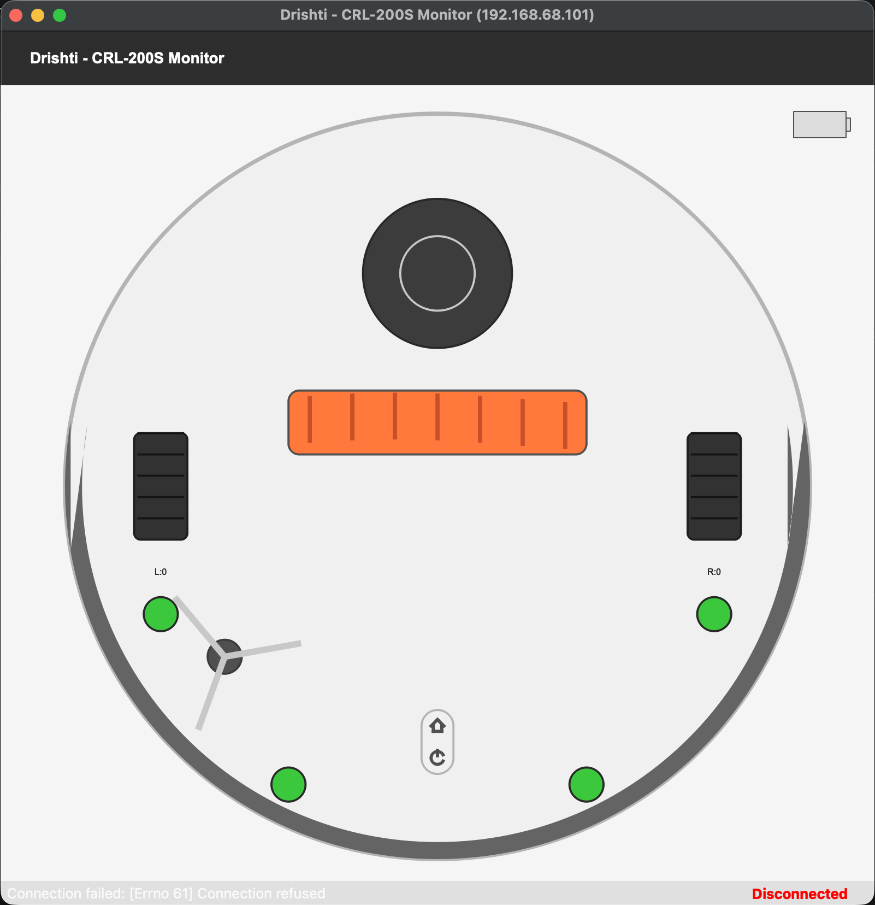

# VacuumTiger

**Open-source firmware for hackable vacuum robots**

VacuumTiger is a modular, configuration-driven firmware stack that makes it easy to build autonomous vacuum robots. Define your sensors and actuators in TOML, and the system handles everything else—from real-time control to network streaming.

## Why VacuumTiger?

- **Configurable**: Define sensors, actuators, and hardware in a single TOML file
- **Extensible**: Add new robot platforms by implementing one trait
- **Generic Protocol**: TCP streaming works with any SLAM application
- **Real-time**: 110Hz sensor updates, <25ms command latency
- **Hackable**: Small codebase (~4K lines Rust), no dependencies on proprietary SDKs

## How It Works

```
┌─────────────────────────────────────────────────┐
│          SLAM Application (Planned)             │
│   Reads sangamio.toml to discover capabilities  │
└─────────────┬───────────────────────────────────┘
              │ TCP Protocol (Generic)
┌─────────────▼───────────────────────────────────┐
│            SangamIO Daemon                      │
│   Configuration-driven hardware abstraction     │
│   • Streams sensor groups defined in config     │
│   • Routes commands to configured actuators     │
└─────────────┬───────────────────────────────────┘
              │ DeviceDriver Trait
┌─────────────▼───────────────────────────────────┐
│   Robot-Specific Driver (e.g., CRL-200S)        │
│   Implements protocol for specific hardware     │
└─────────────────────────────────────────────────┘
```

## Configuration-Driven Design

Everything is defined in `sangamio.toml`:

```toml
[device]
type = "crl200s"
name = "CRL-200S Vacuum Robot"

[device.hardware]
gd32_port = "/dev/ttyS3"
lidar_port = "/dev/ttyS1"
heartbeat_interval_ms = 20

[network]
bind_address = "0.0.0.0:5555"
```

**SLAM applications read this same config** to discover what sensors and actuators are available, enabling truly portable navigation algorithms.

## Generic TCP Protocol

The protocol is robot-agnostic. Any client that speaks the wire format can control any VacuumTiger robot.

### Message Format

```
[4-byte length (big-endian)][Protobuf payload]
```

All communication uses Protocol Buffers for efficient binary serialization. See `sangam-io/proto/sangamio.proto` and `dhruva-slam/proto/dhruva.proto` for schema definitions.

### Component Actions

| Action | Description | Example |
|--------|-------------|---------|
| `Enable` | Activate component | `{"type": "Enable"}` |
| `Disable` | Deactivate component | `{"type": "Disable"}` |
| `Reset` | Emergency stop / factory reset | `{"type": "Reset"}` |
| `Configure` | Set parameters (velocity, speed) | `{"type": "Configure", "config": {...}}` |

### Supported Components

| Component | Enable | Disable | Configure |
|-----------|--------|---------|-----------|
| `drive` | Nav mode | Stop | `{linear, angular}` or `{left, right}` |
| `vacuum` | 100% | Off | `{speed: U8}` |
| `main_brush` | 100% | Off | `{speed: U8}` |
| `side_brush` | 100% | Off | `{speed: U8}` |
| `lidar` | Power on | Power off | - |
| `led` | - | - | `{state: U8}` |

## Adding a New Robot Platform

VacuumTiger is designed to support any robot hardware. Here's how to add a new platform:

### 1. Create Configuration

```toml
[device]
type = "my_robot"

[device.hardware]
motor_port = "/dev/ttyUSB0"
heartbeat_interval_ms = 20

[network]
bind_address = "0.0.0.0:5555"
```

### 2. Implement DeviceDriver Trait

```rust
// src/devices/my_robot/mod.rs
pub struct MyRobotDriver { /* ... */ }

impl DeviceDriver for MyRobotDriver {
    fn initialize(
        &mut self,
        sensor_data: HashMap<String, Arc<Mutex<SensorGroupData>>>
    ) -> Result<()> {
        // Open serial ports
        // Spawn reader threads
        // Update sensor_data in real-time
    }

    fn send_command(&mut self, cmd: Command) -> Result<()> {
        match cmd {
            Command::ComponentControl { id, action } => {
                // Handle drive, vacuum, lidar, etc.
            }
            Command::Shutdown => { /* ... */ }
        }
    }
}
```

### 3. Register in Factory

```rust
// src/devices/mod.rs
pub fn create_device(config: &Config) -> Result<Box<dyn DeviceDriver>> {
    match config.device.device_type.as_str() {
        "crl200s" => Ok(Box::new(CRL200SDriver::new(...))),
        "my_robot" => Ok(Box::new(MyRobotDriver::new(...))),
        _ => Err(Error::UnknownDevice(...)),
    }
}
```

That's it! Your new robot works with any existing SLAM application.

## Repository Structure

```
VacuumTiger/
├── sangam-io/              # Hardware abstraction daemon (Rust)
│   ├── src/
│   │   ├── core/           # DeviceDriver trait, SensorValue types
│   │   ├── devices/        # Robot-specific implementations
│   │   │   └── crl200s/    # CRL-200S driver (GD32 + Delta-2D)
│   │   └── streaming/      # TCP protocol, Protobuf wire format
│   ├── proto/              # Protobuf schema definitions
│   ├── sangamio.toml       # Robot configuration
│   ├── COMMANDS.md         # GD32 command reference
│   └── SENSORSTATUS.md     # Sensor packet documentation
├── dhruva-slam/            # 2D SLAM daemon (Rust)
│   ├── src/
│   │   ├── core/           # Foundation types (Pose2D, PointCloud2D)
│   │   ├── sensors/        # Odometry fusion, lidar preprocessing
│   │   ├── algorithms/     # Scan matching, mapping, loop closure
│   │   ├── engine/         # SLAM orchestration, pose graph
│   │   └── io/             # SangamIO client, TCP streaming
│   └── proto/              # SLAM message definitions
├── drishti/                # Diagnostic visualization (Python)
│   ├── drishti_ui.py       # PyQt GUI with sensor overlays
│   ├── drishti.py          # Console client
│   └── ui/                 # PyQt widgets and processors
├── slam-test/              # SLAM integration test framework
└── protocol-mitm/          # Reverse engineering tools
```

## Quick Start

### Build SangamIO

```bash
# Install Rust with ARM target
rustup target add armv7-unknown-linux-musleabihf

# Build for robot
cd sangam-io
cargo build --release --target armv7-unknown-linux-musleabihf
```

### Deploy to Robot

```bash
# Copy binary to robot
cat target/armv7-unknown-linux-musleabihf/release/sangam-io | \
  ssh root@vacuum "cat > /usr/sbin/sangamio && chmod +x /usr/sbin/sangamio"

# Run daemon
ssh root@vacuum "RUST_LOG=info /usr/sbin/sangamio"
```

### Connect with Drishti

```bash
cd drishti
pip install -r requirements.txt
python drishti_ui.py --robot 192.168.68.101
```



## Project Status

| Component | Status | Notes |
|-----------|--------|-------|
| SangamIO Daemon | ✅ Complete | Config-driven, ~350KB binary |
| CRL-200S Driver | ✅ Verified | GD32 motor controller + Delta-2D lidar |
| TCP Protocol | ✅ Complete | Protobuf binary streaming |
| Drishti UI | ✅ Complete | Real-time sensor visualization |
| DhruvaSLAM | ✅ Complete | 2D SLAM with multi-algorithm support |
| SLAM Integration Tests | ✅ Complete | Round-trip test framework |
| Additional Platforms | 📋 Planned | Roomba, Turtlebot, etc. |

## Contributing

Help us build the best open-source vacuum robot firmware:

- **New platforms**: Implement DeviceDriver for your robot
- **SLAM**: Build navigation algorithms using the generic protocol
- **Sensors**: Add support for new lidar models, IMUs
- **Documentation**: Improve guides and examples

## Safety Notice

⚠️ This firmware controls physical hardware. Always:
- Test in a safe, controlled environment
- Keep emergency stop accessible
- Monitor battery voltage during operation

## License

Apache License 2.0. See [LICENSE](LICENSE) for details.

## Links

- [Original Research](https://github.com/codetiger/VacuumRobot)
